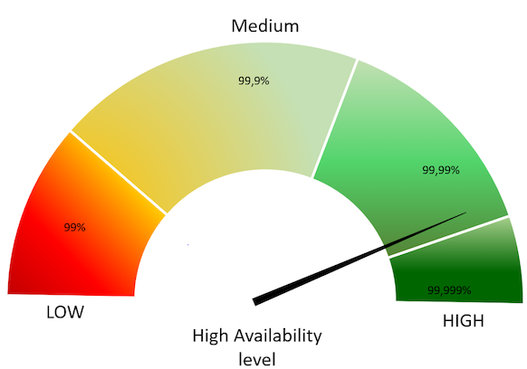

# High availability solution with Group Replication

Every architecture and deployment depends on customer requirements and application demands for high availability and the estimated level of usage.  For example, using a high read or a high write application, or both with  99.999% availability.

This guide gives [architecture](architecture-components.md) and deployment recommendations along with a technical overview for a solution that provides a high level of high availability and assumes the usage of high read / write applications (20K or more queries per second). It also provides [step-by-step deployment guidelines](deploy-pdps-group-replication.md).

This solution assumes the use of *Percona Server for MySQL* based deployment variant of Percona Distribution for MySQL with [Group Replication](https://dev.mysql.com/doc/refman/8.0/en/group-replication.html).


## High availability overview

How to measure availability and at what point does it become “high” availability?

Generally speaking, the measurement of availability is done by establishing a measurement time frame and dividing it by the time that it was available. This ratio will rarely be 1, which is equal to 100% availability. A solution is considered to be highly available if it is at least 99% or “two nines” available.

The following table provides downtime calculations per high availability level:

| Availability, %    | Downtime per year | Downtime per month | Downtime per week | Downtime per day|
| ------------------ | ----------------- | ------------------ | -------------- | ---------------- |
| 99% (“two nines”)  | 3.65 days         | 7.31 hours         | 1.68 hours     | 14.40 minutes    |
| 99.5% (“two nines five”) | 1.83 days   | 3.65 hours         | 50.40 minutes  | 7.20 minutes     |
| 99.9% (“three nines”)    | 8.77 hours  | 43.83 minutes      | 10.08 minutes  | 1.44 minutes     |
| 99.95% (“three nines five”)| 4.38 hours| 21.92 minutes      | 5.04 minutes   | 43.20 seconds    |
| 99.99% (“four nines”)  | 52.60 minutes | 4.38 minutes       | 1.01 minutes   | 8.64 seconds     |
| 99.995% (“four nines five”)| 26.30 minutes| 2.19 minutes    | 30.24 seconds  | 4.32 seconds     |
| 99.999% (“five nines”)| 5.26 minutes   | 26.30 seconds      | 6.05 seconds   | 864.00 milliseconds |


### How is high availability achieved?

There are three key components to achieve high availability:

* **Infrastructure** - This is the physical or virtual hardware that database systems rely on to run. Without enough infrastructure (VM’s, networking, etc.), there cannot be high availability. The easiest example is: `there is no way to make a single server highly available`.


* **Topology management** - This is the software management related specifically to the database and managing its ability to stay consistent in the event of a failure. Many clustering or synchronous replication solutions offer this capability out of the box. However, asynchronous replication is handled by additional software.


* **Connection management** - This is the software management related specifically to the networking and connectivity aspect of the database. Clustering solutions typically bundle with a connection manager. However, in asynchronous clusters, deploying a connection manager is mandatory for high availability.

This solution is based on a tightly coupled database cluster. It offers a high availability level of 99.995% when coupled with the Group Replication setting `group_replication_consistency=AFTER`.




## Failovers

A database failure or configuration change that requires a restart should not affect the stability of the database infrastructure, if it is properly planned and architected. Failovers are an integral part of a stability strategy and aligning the business requirements for availability and uptime with failover methodologies is critical.

The following are the three main types of failovers that can occur in database environments:


* **Planned failover**. This is a failover that has been scheduled in advance or occurs at a regular interval. There can be many reasons for planned failovers including patching, large data operations, retiring existing infrastructure, or simply to test the failover strategy.


* **Unplanned failover**. This is what occurs when a database has unexpectedly become unresponsive or experiences instability. An unplanned failover could also include emergency changes that do not fall under the planned failover cadence or scheduling parameters. Unplanned failovers are generally considered higher risk operations due to the high stress and high potential for data corruption or data fragmentation.


* **Regional or disaster recovery (DR) failover**. Unplanned failovers still work with the assumption that additional database infrastructure is immediately available and in a usable state. However, in a regional or DR failover, it is assumed that there is a large scale infrastructure outage which requires the business to move its operations away from its current availability zone.

## Maintenance windows

### Major vs Minor maintenance

Although it may not be obvious at first, not all maintenance activities are created equal and do not have the same dependencies. It is good to separate maintenance that demands downtime or failover from maintenance that can be done without impacting those important stability metrics. When defining these maintenance dependencies, there can be a change in the actual maintenance process that allows for a different cadence.

### Maintenance without service interruption

It is possible to cover both major and minor maintenance without service interruption with rolling restart and using proper version upgrade.

## Uptime

When referring to database stability, uptime is likely the largest indicator of stability and often is the most obvious symptom of an unstable database environment. Uptime is composed of three key components and, contrary to common perception, is based on what happens when the database software cannot take incoming requests rather than maintain the ability to take requests with errors.

The uptime components are:

* **Recovery Time Objective (RTO)**

RTO can be characterized by a simple question “How long can the business sustain a database outage?” Once the business is aligned with a minimum viable recovery time objective, it is much more straightforward to plan and invest in the infrastructure required to meet that requirement. It is important to acknowledge that while everyone desires 100% uptime, there need to be realistic expectations that align with the business needs and not a technical desire.

* **Recovery Point Objective (RPO)**

There is a big distinction between the Recovery Point and the Recovery Time for a database infrastructure. The database can be available, but not to the exact state that it was when it became unavailable. That is where Recovery Point comes in. The question to ask here is “How much data can the business lose during a database outage?” All businesses have their own requirements here yet it is always the goal to never sustain any data loss. But this is framed in the worst case scenario, how much data could be lost and the business maintains the ability to continue.

* **Disaster recovery**

RTO and RPO are great for unplanned outages or small scale hiccups to the infrastructure. Disaster recovery is a major large scale outage not strictly for the database infrastructure. How capable is the business of restarting operations with the assumption that all resources are completely unavailable in the main availability zone? The assumption here is that there is no viable restoration point or time that aligns with the business requirements. While each disaster recovery scenario is unique based on available infrastructure, backup strategy and technology stack, there are some common threads for any scenario.

The described solution **helps improve uptime**. It will help you to significantly reduce both RPO and RTO. Given the tightly coupled cluster solution approach, the failure of a single node will not result in service interruption.

Increasing the number of nodes will also improve the cluster resilience by the formula:

```
F = (N -1) / 2
```

where:


* `F` is the number of admissible failures


* `N` is the number of nodes in the cluster.

### Example

* In a cluster of 5 nodes, F = (5 - 1)/2 = 2. The cluster can support up to 2 failures.

* In a cluster of 4 nodes, F = (4 - 1)/2 = 1. The cluster can support up to 1 failure.

This solution also allows for a more restrictive backup policy, dedicating a node to the backup cycle, which will help in keeping RPO low.

As previously mentioned, disaster recovery is not covered by default by this solution. It will require an additional replication setup and controller.


!!! admonition "Based on the material from Percona Database Performance Blog"

    This document is based on the blog post [Percona Distribution for MySQL: High Availability with Group Replication Solution](https://www.percona.com/blog/2021/04/14/percona-distribution-for-mysql-high-availability-with-group-replication-solution/) by *Marco Tusa*
